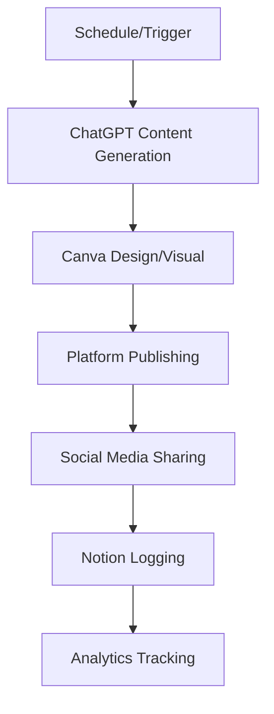

# Income Generation Workflows - Complete Automation System

## 📋 Overview

This repository contains comprehensive automated workflow files for generating income using modern platforms and AI tools. Each workflow is designed to be implemented with minimal manual effort using automation tools like n8n, ChatGPT, and various platform APIs.

## 🎯 Available Workflows

### 1. [Dropshipping](./dropshipping/)
**Platforms**: Shopify, Alibaba, Amazon, AliExpress  
**Estimated Revenue**: $3,000 - $10,000+/month  
**Startup Cost**: $500 - $2,000  
**Difficulty**: ⭐⭐⭐

Fully automated dropshipping system with product research, supplier sourcing, listing creation, and order fulfillment.

### 2. [Affiliate Marketing](./affiliate-marketing/)
**Platforms**: Amazon Associates, ClickBank, YouTube, WordPress  
**Estimated Revenue**: $1,000 - $5,000+/month  
**Startup Cost**: $200 - $500  
**Difficulty**: ⭐⭐

Content-driven affiliate marketing through blogs, YouTube, and email with automated content creation and SEO.

### 3. [Blogging](./blogging/)
**Platforms**: WordPress, Medium, Substack  
**Estimated Revenue**: $1,000 - $5,000+/month  
**Startup Cost**: $100 - $300  
**Difficulty**: ⭐⭐⭐

Automated blogging system with AI content generation, SEO optimization, and monetization through ads and sponsorships.

### 4. [AI Building](./ai-building/)
**Platforms**: OpenAI, Anthropic, Vercel, Stripe  
**Estimated Revenue**: $1,000 - $20,000+/month  
**Startup Cost**: $100 - $500  
**Difficulty**: ⭐⭐⭐⭐

Build and monetize AI-powered SaaS applications and tools using ChatGPT and other AI APIs.

### 5. [Faceless YouTube](./faceless-youtube/)
**Platforms**: YouTube, ElevenLabs, Pictory, Canva  
**Estimated Revenue**: $1,000 - $10,000+/month (at scale)  
**Startup Cost**: $100 - $300/month  
**Difficulty**: ⭐⭐⭐

Create faceless YouTube channels using AI for scripts, voiceovers, and video creation.

### 6. [Advertising](./advertising/)
**Platforms**: Google Ads, Facebook Ads, TikTok Ads  
**Estimated Spend**: $1,500 - $10,000/month  
**Target ROAS**: 3-5x  
**Difficulty**: ⭐⭐⭐⭐

Automated advertising campaigns with AI-generated ad copy and smart budget optimization.

### 7. [Marketing](./marketing/)
**Platforms**: Email, Social Media, Content  
**Estimated Revenue**: $2,000 - $10,000+/month  
**Startup Cost**: $200 - $1,000  
**Difficulty**: ⭐⭐⭐

Comprehensive marketing automation across multiple channels with AI-powered content creation.

### 8. [E-commerce](./ecommerce/)
**Platforms**: Shopify, Amazon, eBay  
**Estimated Revenue**: $5,000 - $50,000+/month  
**Startup Cost**: $1,650 - $7,400  
**Difficulty**: ⭐⭐⭐⭐

Full e-commerce automation with inventory management, pricing optimization, and customer service.

### 9. [Print on Demand](./print-on-demand/)
**Platforms**: Printful, Printify, Etsy, Redbubble  
**Estimated Revenue**: $1,000 - $10,000+/month  
**Startup Cost**: $150 - $600/month  
**Difficulty**: ⭐⭐

Zero-inventory business selling custom-designed products with automated fulfillment.

### 10. [Digital Products](./digital-products/)
**Platforms**: Gumroad, Etsy, Shopify, Teachable  
**Estimated Revenue**: $1,000 - $10,000+/month  
**Startup Cost**: $25 - $50/month  
**Difficulty**: ⭐⭐

Create and sell digital products with 90%+ profit margins and instant automated delivery.

## 🛠️ Core Tools & Platforms

### Automation
- **n8n** - Workflow automation (free/self-hosted)
- **Zapier** - Alternative automation ($20-50/month)
- **Make (Integromat)** - Visual automation ($9-29/month)

### AI Tools
- **ChatGPT** - Content generation ($20/month)
- **Claude** - Alternative AI ($20/month)
- **Midjourney** - AI image generation ($10-60/month)
- **ElevenLabs** - AI voice ($22/month)

### Design & Content
- **Canva Pro** - Graphics and design ($13/month)
- **Figma** - UI/UX design (Free-$12/month)
- **Pictory** - Video creation ($23/month)
- **InVideo** - Video editor ($25/month)

### E-commerce
- **Shopify** - Store platform ($29-299/month)
- **WooCommerce** - WordPress e-commerce (Free + hosting)
- **Printful/Printify** - Print on demand (Pay per order)

### Marketing
- **Mailchimp/ConvertKit** - Email marketing ($0-50/month)
- **Buffer/Hootsuite** - Social media ($15-30/month)
- **SEMrush/Ahrefs** - SEO tools ($99-399/month)

### Project Management
- **Notion** - Database and tracking (Free-$10/month)
- **Taskade** - Task management (Free-$10/month)
- **Trello** - Project boards (Free-$10/month)

## 📁 File Structure

Each workflow directory contains:

```
workflow-name/
├── README.md                    # Complete guide and documentation
├── workflow-name-workflow.json  # Detailed workflow definition
├── n8n-workflow.json           # n8n automation workflow (if applicable)
├── taskade-template.md         # Daily/weekly task templates
└── notion-template.md          # Database structure (if applicable)
```

## 🚀 Getting Started

### Quick Start Guide

1. **Choose a workflow** based on:
   - Your budget
   - Time commitment
   - Skills/interest
   - Revenue goals

2. **Read the README** in the workflow folder for:
   - Complete setup instructions
   - Tool requirements
   - Cost breakdown
   - Timeline expectations

3. **Set up required tools**:
   - Create accounts on necessary platforms
   - Get API keys
   - Install n8n (if using automation)

4. **Import workflows**:
   - Import n8n workflows (if applicable)
   - Set up Taskade templates
   - Configure Notion databases

5. **Start executing**:
   - Follow daily task checklists
   - Monitor automation workflows
   - Track metrics in Notion

## 💰 Revenue Potential Comparison

| Workflow | Monthly Revenue | Startup Cost | Difficulty | Time to Profit |
|----------|----------------|--------------|------------|----------------|
| Digital Products | $1k - $10k+ | $25-50 | ⭐⭐ | 1-3 months |
| Print on Demand | $1k - $10k+ | $150-600 | ⭐⭐ | 2-6 months |
| Affiliate Marketing | $1k - $5k+ | $200-500 | ⭐⭐ | 3-6 months |
| Blogging | $1k - $5k+ | $100-300 | ⭐⭐⭐ | 6-12 months |
| Dropshipping | $3k - $10k+ | $500-2k | ⭐⭐⭐ | 1-3 months |
| Faceless YouTube | $1k - $10k+ | $100-300/mo | ⭐⭐⭐ | 3-6 months |
| Marketing Services | $2k - $10k+ | $200-1k | ⭐⭐⭐ | 2-4 months |
| E-commerce | $5k - $50k+ | $1.6k-7.4k | ⭐⭐⭐⭐ | 2-4 months |
| AI Building | $1k - $20k+ | $100-500 | ⭐⭐⭐⭐ | 1-3 months |
| Advertising | Variable | $1.5k-10k/mo | ⭐⭐⭐⭐ | Immediate |

## 📊 Recommended Starting Path

### For Beginners ($100-500 budget)
1. **Start**: Digital Products or Print on Demand
2. **Reason**: Low cost, low risk, simple to understand
3. **Timeline**: 2-3 months to first profit

### For Intermediate ($500-2,000 budget)
1. **Start**: Affiliate Marketing or Dropshipping
2. **Reason**: Proven models, good resources, scalable
3. **Timeline**: 1-3 months to first profit

### For Advanced ($2,000+ budget)
1. **Start**: E-commerce or AI Building
2. **Reason**: Higher returns, competitive advantage
3. **Timeline**: 1-2 months to first profit

### For Technical Users
1. **Start**: AI Building
2. **Reason**: Use existing skills, high margins
3. **Timeline**: 2-4 weeks to first product

## 🔄 Automation Workflow

### Universal Automation Pattern



### Key Automation Benefits
- ⏰ **Save 10-20 hours per week**
- 🎯 **Consistency in execution**
- 📈 **Scalability without more time**
- 💰 **Focus on strategy, not tasks**
- 🤖 **24/7 operation**

## 📚 Learning Resources

### General
- YouTube: Search "[workflow name] automation"
- Reddit: /r/SideHustle, /r/Entrepreneur
- Indie Hackers: Community and resources
- Twitter: Follow #buildinpublic

### Platform-Specific
- Shopify Academy (Free courses)
- Amazon Seller University
- YouTube Creator Academy
- n8n Documentation
- ChatGPT Cookbook

## ⚠️ Important Notes

### Legal & Compliance
- Always disclose affiliate relationships
- Follow platform terms of service
- Pay taxes on income
- Use licensed content only
- Don't make false claims

### Realistic Expectations
- **Not get-rich-quick**: All workflows require work
- **Learning curve**: 1-3 months to proficiency
- **Initial investment**: Both time and money
- **Failure rate**: Test and iterate
- **Patience required**: Most take 3-6 months to profit

### Success Factors
✅ Consistency
✅ Quality over quantity
✅ Testing and optimization
✅ Customer focus
✅ Continuous learning
✅ Automation mindset

## 🔗 Platform Links

### E-commerce
- [Shopify](https://shopify.com)
- [Amazon Seller Central](https://sellercentral.amazon.com)
- [Etsy](https://etsy.com/sell)

### Automation
- [n8n](https://n8n.io)
- [Zapier](https://zapier.com)
- [Make](https://make.com)

### AI Tools
- [OpenAI](https://platform.openai.com)
- [Anthropic](https://anthropic.com)
- [Midjourney](https://midjourney.com)

### Design
- [Canva](https://canva.com)
- [Figma](https://figma.com)

## 💬 Support

For questions or issues:
1. Check the README in specific workflow folder
2. Review platform documentation
3. Search relevant subreddits
4. Join Discord communities
5. Watch YouTube tutorials

## 📝 License

These workflows are provided as educational resources. Always ensure you comply with:
- Platform terms of service
- Local laws and regulations
- Copyright and trademark laws
- Tax requirements
- Business licensing (if applicable)

## 🎯 Next Steps

1. **Choose 1-2 workflows** to start
2. **Read full documentation** in those folders
3. **Set up accounts** on required platforms
4. **Import automation workflows**
5. **Start executing** daily tasks
6. **Track progress** in Notion
7. **Optimize based** on results
8. **Scale what works**

Remember: The best time to start was yesterday. The second best time is now.

Good luck! 🚀
